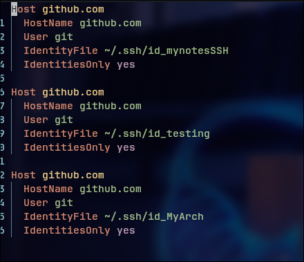

= Steps to create a remote git repository =

1. Follow the image bellow, use "git add ." instead, git push you probably not work

2. Now create a ssh key with "ssh-keygen -t ed25519 -f ~/.ssh/id_<NameOfYourKey>" -C "youreamil" 
   

3. Use the command bellow with the id_ you created
 

4. Follow the commands bellow:

5. Open ~/.ssh/config and follow the pattern of the image bellow, using the key you created:
 

Now git push should work.
