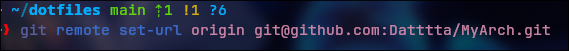

= Steps to create a remote git repository =

1. Follow the image bellow, use "git add ." instead, git push you probably not work

1.1 Now run the command bellow to set you email:

2. Now create a ssh key with "ssh-keygen -t ed25519 -f ~/.ssh/id_<NameOfYourKey>" -C "youreamil" 
   

3. Use the command bellow with the id_ you created
 

4. Follow the commands bellow:

5. Open ~/.ssh/config and follow the pattern of the image bellow, using the key you created:

Create a Host with a different name from the others

6. Run the command below, pay attention to the "github-My-Arch" this should name of the host you created, and the last "/MyArch" should be the name of your repository e.g. /My_notes:
git push --repo=git@github-notes:Datttta/My_Notes.git

Now git push should work.
